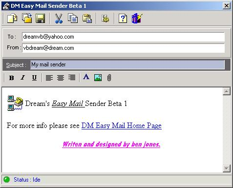



## DM Easy Mail Sender

### Description

Hi Eveyone Ok this is my first E-Mail sender I see lot's of Exampls of email sender so I though it was about time I made one. anyway It very easy to use. You can send real html formated messages and a very simple to use Editor also this uses the DHTML control you can also save your messages as well for a latter date anyway please vote and leve Comments about it if you like it I will bring out a new verision soon.
 
### More Info
 

             |
---                |---
**Submitted On**   |2001-07-26 16:41:38
**By**             |[dreamvb](https://github.com/Planet-Source-Code/PSCIndex/blob/master/ByAuthor/dreamvb.md)
**Level**          |Beginner
**User Rating**    |4.7 (104 globes from 22 users)
**Compatibility**  |VB 6\.0
**Category**       |[Internet/ HTML](https://github.com/Planet-Source-Code/PSCIndex/blob/master/ByCategory/internet-html__1-34.md)
**World**          |[Visual Basic](https://github.com/Planet-Source-Code/PSCIndex/blob/master/ByWorld/visual-basic.md)
**Archive File**   |[DM Easy Ma262669102001\.zip](https://github.com/Planet-Source-Code/dreamvb-dm-easy-mail-sender__1-27133/archive/master.zip)

